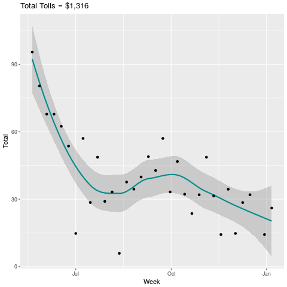

# ExpressToll

After cloning the repo you can run a few lines of R code to visualize what the toll expenditures look like.

### R Code 
```r
library(lubridate)
library(ggplot2)
library(dplyr)


mydata <- read.csv(file = "tolls.csv")
names(mydata) <- gsub(pattern = "\\.",replacement = "",x = names(mydata))
mydata$TransactionDateTime <- strptime(mydata$TransactionDateTime,format = 
                                         "%m-%d-%Y %H:%M:%S")

mydata$TransactionDateTime <- as.POSIXct(mydata$TransactionDateTime )
mydata$Date <- as.Date(mydata$TransactionDateTime )
mydata$Amount <-as.numeric( gsub(pattern = "\\$",replacement = "",
                                 x = mydata$Amount) )
mydata$Week <- floor_date(mydata$Date, unit = "week")


bigm <- function(x) paste0("$",formatC(x = x,digits = 0,big.mark = ",",format = "d"))
TotalTolls <- sum(mydata$Amount)

png("TollsByWeek.png")
mydata %>%
  group_by(Week) %>%
  summarise(Total = sum(Amount)) %>%
  data.frame() %>% 
  ggplot( aes(y=Total,x=Week)) + 
  # geom_line() +
  geom_smooth(color="cyan4") +
  geom_point(color="black") + 
  ggtitle(label = paste0("Total Tolls = ",bigm(TotalTolls) ) ) 
dev.off()
```

### Tolls By Week 


### Tolls By Day of Week

```

